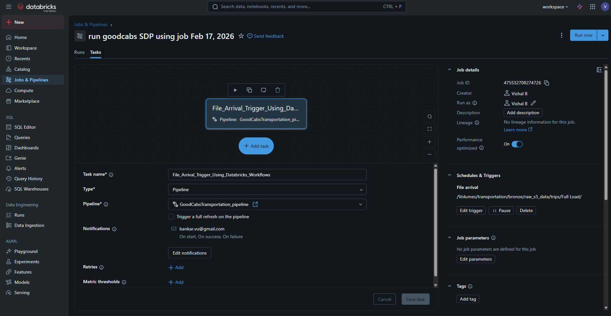

# Lakeflows-Spark-Declarative-Pipelines-in-Databricks-project
Databricks free edition end to end Data Engineering Project using Databricks LakeFlow Spark Declarative Pipelines (SDP)

# 🧩Problem Statement

Good Cabs, a fast-growing ride-hailing company operating across multiple cities, relies heavily on regional analytics to support daily decision-making. As the business scales, regional managers increasingly require timely, city-specific insights such as ride volume, revenue, and customer ratings.

However, the existing data platform is built using procedural Spark pipelines with manual orchestration, leading to several challenges:

- Data delivery to regional teams is delayed

- Dashboards provide generic, non-region-specific views

- Regional teams must manually export and rework data

- Pipelines are tightly coupled, difficult to modify, and slow to scale

- Innovation is limited due to high operational overhead

As a result, stakeholder trust in the data platform has declined, and the organization risks changing its platform direction if faster and more flexible analytics cannot be delivered.

# Objective

Design and implement an end-to-end data engineering pipeline using Databricks LakeFlow Spark Declarative Pipelines (SDP) that:

- Ingests raw transportation data reliably

- Processes data through Bronze, Silver, and Gold layers

- Automatically manages dependencies and orchestration

- Enables incremental and scalable processing

- Delivers region-level, analytics-ready datasets faster

- Reduces manual effort while improving platform agility

The solution must be implemented using the Databricks Free Edition, demonstrating how modern, production-grade data engineering practices can be learned and applied without infrastructure complexity. 

# Project Archetecture diagram

----------------------------------------------------------
# pipeline graph png

# Pipeline Job to Schedule incremental load as soon as new file comes

Steps to follow
